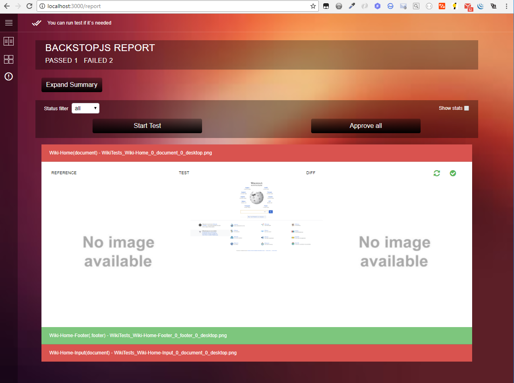
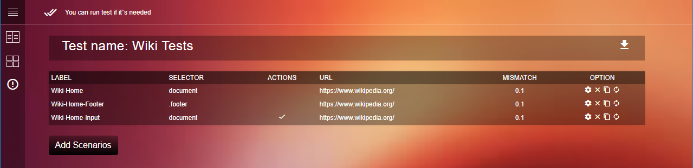
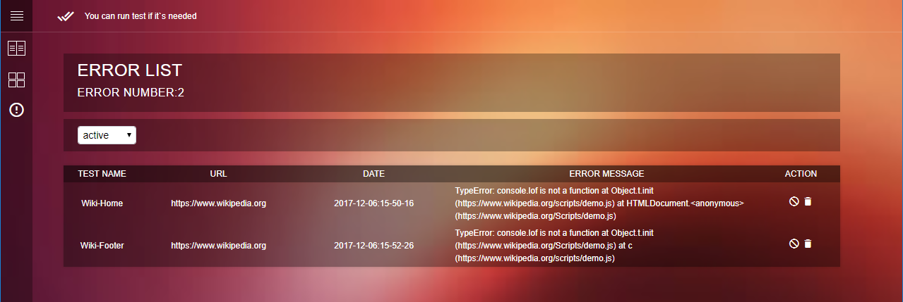

# Backstop UI

BackstopUI is sugar for [BackstopJS](https://github.com/garris/BackstopJS). The main idea of project is providing a list of examples, how to do different stuff and make the process of managing test more visual.


## Getting Started

1. ```git clone https://github.com/anton-kulagin/service-server.git ```
2. ``` npm install ```
3. ``` npm start ```  or run ```service_runner/server-start.bat```
4. Open in browser [localhost:3000](localhost:3000)


### Prerequisites
1. Nodejs 8.9.1 or higher
2. Npm 5.5.1 or higher
3. [Chrome 62 or greater is required](https://www.google.com/chrome/browser/desktop/index.html)
4. Read [BackstopJS readme](https://github.com/garris/BackstopJS)

## API <br>
- ```/api/report``` - [GET] return latest tests result in JSON format.
- ```/api/service?method=&filter=``` - [GET] url for processing backstop tasks
    - ```method=``` - Method parameter just say backstop which one method you want to start.(```test``` or ```approve```)
    - ```filter=``` - Filter parameter if for just running scenarios matching your scenario label. (will run all if empty)
- ```/api/config``` - 
    - [GET] return test list in JSON format.
    - [POST] update list of tests.
- ```/api/download``` - [GET] return backstop.json file for downloading.
- ```/api/errors``` - 
    - [GET] - return list of console errors in JSON.(In case you include logic)
    - [POST] - update list of errors.
- ```/api/process-state``` - 
    - [GET] Return state of process in JSON. Does backstop in process of testing. ```True``` if yes
    ```{"state": true}```
    - ```/api/process-state/reset-state``` - [GET] will reset state to false.


## UI
### Report Tab

This is the page with all test result, which we already have. From this page whole sets of test can be started, or approved by `Start Test` and `Approve all` buttons. Under each failed test also placed two additional buttons. One for restart just this one test, and second for approving only this test.

### Test List Tab

This is the page with all tests. This page provide possibility add new scenario, download backstop.json file (it can be helpful when there is no access to hard drive) and manage tests. In option row for each scenario there is 4 possibility action. 
1. Option - will open test on the new page and provide possibility to configure test.
2. Remove
3. Copy
4. Start test

### Error List Tab

On this page will be stored all console errors which will be captured by backstopjs.
Be aware, on this page error will appear only if logic for capturing them will be added in onBefore script.


## Authors

* **Garris Shipon** - *BackstopJS author* - [BackstopJS](https://github.com/garris/BackstopJS)
* **Anton Kulagin** - *BackstopUI author* - [BackstopUI](https://github.com/anton-kulagin/service-server)


## License

This project is licensed under the MIT License - see the [LICENSE.md](LICENSE.md) file for details
